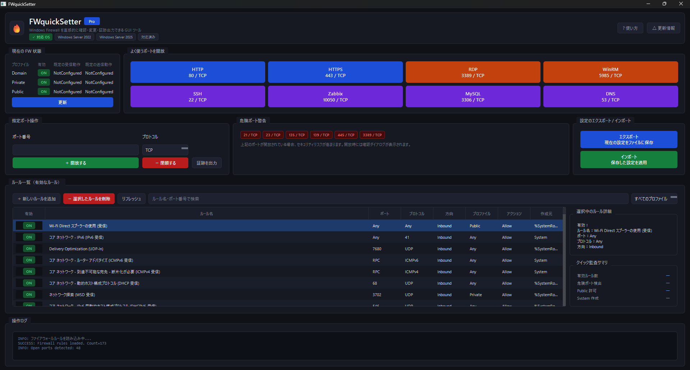

# 🔥 FWquickSetter Pro

Windows Firewall を GUI で直感的に管理できる  
Windows / Windows Server 向け Firewall 管理ツール。

---

## ✨ 特徴

- GUI による Firewall ルール確認
- TCP / UDP ポートの開放・閉鎖
- 危険ポート警告
- Firewall ルール一覧表示
- ルール検索
- 設定エクスポート / インポート
- 証跡（エビデンス）出力
- Windows Server 向けダークテーマ UI

---

## 🖥 対応OS

- Windows 10
- Windows 11
- Windows Server 2022
- Windows Server 2025

---

# 📸 スクリーンショット



---

# 🚀 起動方法

## 1. リポジトリ取得

```powershell
git clone https://github.com/aya-technical-security/FWquickSetter.git
cd FWquickSetter
```

---

## 2. 必要ライブラリをインストール

```powershell
pip install -r requirements.txt
```

---

## 3. 起動

管理者権限 PowerShell で実行：

```powershell
python app.py
```

---

# 🔓 ポート開放

## 手順

1. ポート番号を入力
2. TCP / UDP を選択
3. 「＋ 開放する」をクリック

---

## 例

| 用途 | ポート |
|---|---|
| HTTP | 80 |
| HTTPS | 443 |
| RDP | 3389 |
| SSH | 22 |
| WinRM | 5985 |

---

# 🔒 ポート閉鎖

## 手順

1. ポート番号を入力
2. TCP / UDP を選択
3. 「－ 閉鎖する」をクリック

---

# ⚠ 危険ポート警告

以下のポートを開放する場合、警告ダイアログが表示されます。

| ポート | 内容 |
|---|---|
| 21 | FTP |
| 23 | Telnet |
| 135 | RPC |
| 139 | NetBIOS |
| 445 | SMB |
| 3389 | RDP |

---

# 🔍 ルール検索

検索ボックスから：

- ルール名
- ポート番号
- プロトコル

を検索できます。

---

# 📄 証跡出力

現在の Firewall 状態を txt ファイルとして保存できます。

## 出力先

```text
output/evidence_YYYYMMDD_HHMMSS.txt
```

---

# 💾 設定エクスポート

現在の Firewall 情報を JSON 形式で保存できます。

---

# 📥 設定インポート

保存済み JSON を読み込み、設定を復元できます。

---

# 🛡 管理者権限について

本ツールは Windows Firewall を変更するため、  
管理者権限で実行してください。

---

# 📁 ディレクトリ構成

```text
FWQ/
├─ assets/
├─ config/
├─ core/
├─ output/
├─ powershell/
├─ ui/
├─ app.py
├─ requirements.txt
└─ README.md
```

---

# 📌 今後追加予定

- ルール有効 / 無効切替
- CSV / HTML レポート
- リアルタイム監視
- Active Directory 連携

---

# 📜 License

MIT License

---

# 👤 Author

Aya Nishimura

GitHub:
https://github.com/aya-technical-security